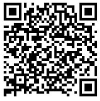

# MobilenetSSD_caffe
How to train and verify mobilenet by using voc pascal data in caffe ssd?

## Introduction
* Help to detect objects by using trained MobileNet SSD models and detect script.
* I downloaded PASCAL-VOC2007/VOC2012 data, and trained and tested MobileNet SSD models in [caffe ssd](https://github.com/weiliu89/caffe.git).
* I developed android jni libs of MoblieNet SSD, and compiled question which you can read my [caffe_ssd-android-lib](https://github.com/avBuffer/caffe_ssd-android-lib.git)
* It can detect 20 classes objects included animal/traffic/house/people etc.

## Requirements
* Caffe SSD
* Android Studio
* Python

## Usage
* Get code
```shell
git clone --recursive https://github.com/avBuffer/MobilenetSSD_caffe.git
cd MobilenetSSD_caffe
```

* Train and test MobilenetSSD models, in folder of mobilenet_caffe_train
  * Step1: Download and create lmdb of PASCAL-VOC2007/VOC2012, and then put train and test lmdb into data/VOC0712 folder
  * Step2: Modify your caffe ssd path in files of train.sh/test.sh and demo.py/merge_bn.py in tool folder and other folders
  * Step3: Do train and test, and get mobilenetssd iter caffemodel
      ```shell
      cd MobilenetSSD_caffe/mobilenet_caffe_train
      ./tool/train.sh
      ```
  * Step4: Change mobilenetssd iter caffemodel
      ```shell
      cd MobilenetSSD_caffe/mobilenet_caffe_train
      ./tool/merge_bn.py
      ```
   * Step5: If you want detect tests, you can do next steps
      ```shell
      cd MobilenetSSD_caffe/mobilenet_caffe_train
      ./tool/demo.py
      ```

* Detect and classify objects by Mobilenet SSD model in PC in the folder of classify_caffe, you can do next steps
  * Step1: Modify your caffe ssd include and libs path in CMakeLists.txt
  * Step2: Compiler
      ```shell
      cd MobilenetSSD_caffe/classify_caffe
      ./build.sh
      ```
  * Step3: Classifier
      ```shell
      cd MobilenetSSD_caffe/classify_caffe
      ./classify.sh
      ```
* Detect and classify objects by Mobilenet SSD model in Android in the folder of MobilenetSSD_APP_demo, you can do next steps
  * Step1: Import MobilenetSSD_APP_demo project into Android Studio
  * Step2: Build APK in Android Studio, and install APK into Smartphone
  * Step3: Create caffe/mobilenet folder in Smartphone SDCard
      ```shell
      cd MobilenetSSD_caffe/classify_caffe/model/mobile/
      adb shell mkdir caffe
      adb shell mkdir caffe/mobilenet
      adb push MobileNetSSD_deploy.caffemodel sdcard/caffe/mobilenet
      adb push MobileNetSSD_deploy.prototxt sdcard/caffe/mobilenet
      ```
  * Step4: You can run APP to select picture or take picture to detect objects

## Issues
* If you have any idea or issues, please keep me informed.
* My Email: jalymo at 126.com, and my QQ/Wechat: 345238818

## Wechat&QQ group 
* I setup VoAI Wechat group, which discusses AI/DL/ML/NLP.
* VoAI means Voice of AI, Vision of AI, Visualization of AI etc.
* You can joint VoAI Wechat group by scanning QR-code in path ./imgs/VoAI.jpg.
* 

* Also you can joint QQ group ID: 183669028

Any comments or issues are also welcomed.Thanks!
